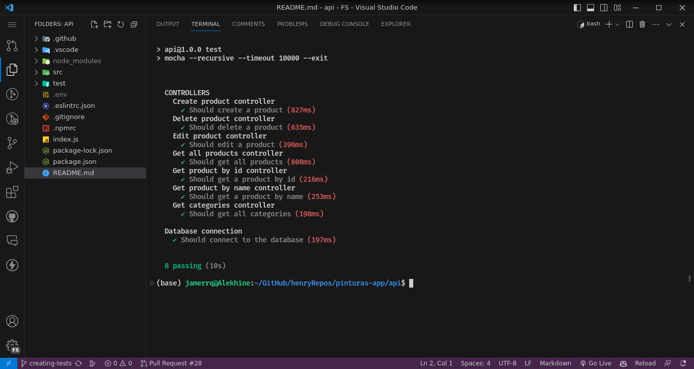

# Pinturas App Backend Server

## Authors:
- [Jamer José](https://github.com/jamerrq)
- [Edgar Juan](https://github.com/ejguercio)
- [Roberto Jardines](https://github.com/charliejp21)
- [Basilio Romero](https://github.com/bachiromero)

## Description
This is the backend server for the Pinturas App.
It is a REST API that allows the user to create, read, update and
delete products, categories, users and orders.
It also allows the user to login and register.

## Technologies
- Node.js
- Express.js
- Sequelize

## Deployment
This project is deployed on Render.com at the following URL:
https://pinturas-app-backend.onrender.com/

## Testing (in progress)
[](https://github.com/PF-Ide-Pintureria/pinturas-app-back/actions/workflows/node.js.yml)

To run the tests, run the following command:
```bash
npm test
```
The tests will run and the results will be displayed on the console.

